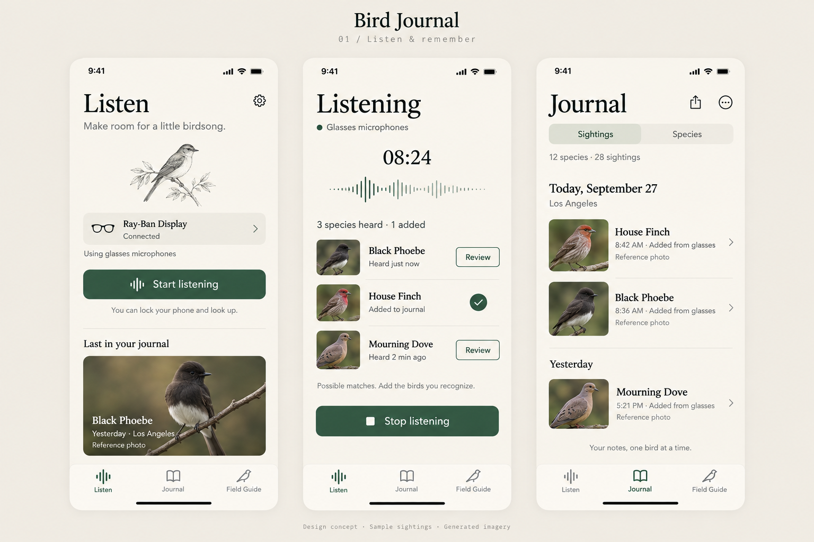
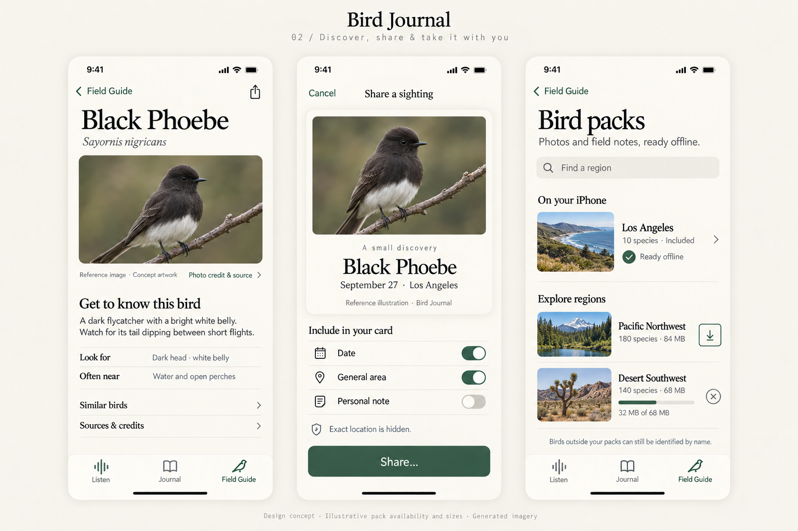
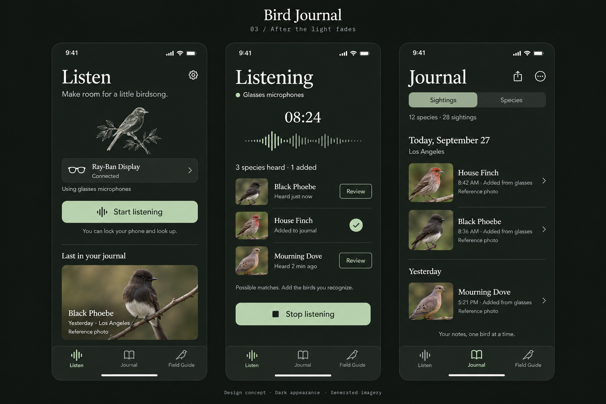

# Bird Journal: approved visual direction

Design workshop: September 27, 2026. The user endorsed these concepts and requested a future GitHub implementation issue. This reference branch contains design artifacts only; it does not implement the redesign.

- [Design guidelines](bird-journal-design-direction.md)
- [Exact image-generation prompts](design-prompts.md)

## Listen and journal

## Discover, share, and packs

## Dark appearance

These images communicate aesthetic direction and information hierarchy. They are generated mockups, not running-app screenshots or production bird-identification imagery. Use verified, credited pack photography in the actual application. Sample sightings and additional pack offerings are illustrative.

The implementation issue establishes delivery scope and acceptance criteria. Its requirements take priority over incidental generated-image details; use current native iOS controls and validate accessibility. The guidelines capture the original workshop, including ideas deliberately deferred from the first implementation.
