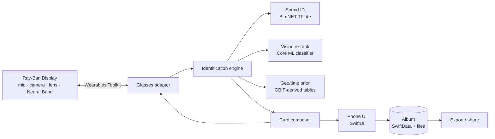

# Bird ID Glasses App — Starting Spec

Sep 25, 2026 · @Matthew Celia

A free, open-source iOS app that listens for birds through Meta Ray-Ban Display glasses, shows swipeable photo cards of the likely species on the lens, and lets you confirm, learn about, and save the bird to an album. Published personally, not through Light Sail VR. Draft for review — everything below is a proposal to argue with.

## What it does

The core loop: hear a bird, see who it probably is, confirm with your eyes, keep it. The glasses are the ears, eyes and heads-up display; the phone does all the identification.

1. **Listen.** User taps the glasses (or says a wake phrase) to start a listening session. Glasses stream mic audio to the phone.
2. **Identify.** BirdNET runs on the phone over rolling 3-second windows. Candidates are filtered by location and week of year, then ranked by confidence.
3. **Show cards.** The lens shows a stack of bird cards: photo, common name, confidence, a one-line field mark. Neural Band swipe moves between cards.
4. **Confirm.** User pinches to confirm the bird they see. Optionally, the glasses camera grabs a frame and a vision model re-ranks the stack before confirming.
5. **Learn and save.** Confirmed bird shows a short info card (range, song description, look-alikes). Pinch-and-hold saves it to the album with time, GPS, the audio clip and any photo.
6. **Review later.** The phone app is the full album: sightings, life list, map, per-species pages, export.

Non-goals for v1: multi-user sharing, eBird checklist submission, non-bird wildlife, Android.

## Platform reality check

The app is feasible on Ray-Ban Display today, but only as a phone app that borrows the glasses' sensors and lens — and it can't be published to the public yet.

| Capability | Status via Meta Wearables Device Access Toolkit (Sept 2026) | Implication |
| --- | --- | --- |
| Microphone audio to phone | Available | Sound ID works |
| Camera photo capture + POV video stream | Available | Visual re-ranking works |
| In-lens display: text, images, lists, buttons, video | Available (Display glasses only) | Cards render on the lens |
| Neural Band gestures (sEMG) | Available as input events | Swipe / pinch navigation |
| Motion, orientation, phone GPS | Available | Geo filter, head-turn cues later |
| On-glasses compute | None — app logic runs on the connected phone | All ML on iPhone |
| iOS native SDK | Swift toolkit; extends an existing iOS app | Single Xcode project |
| Web-app path | HTML/CSS/JS deployed to glasses by URL | Fast prototyping option |
| Public distribution | **Not available during Developer Preview**; native builds limited to 100 testers, web apps by password-protected URL | Ship to testers now; App Store-linked glasses release waits on Meta |

Meta promised general publishing in 2026 and has not delivered as of this week ([VR.org](https://vr.org/articles/meta-glasses-three-tiers-wearables-toolkit-publishing-connect-2026)). Plan for the phone app to be fully useful standalone, with the glasses as an enhancement, so the public open-source release isn't blocked on Meta.

## Architecture

One iOS app, three layers: a glasses adapter, an identification engine, and the album. Everything runs on the phone; nothing requires a server.

- **Glasses adapter** wraps the toolkit: audio stream in, camera frame in, gesture events in, card views out. Behind a protocol so a phone-only mode and a future Android port swap in cleanly.
- **Identification engine** is pure Swift, no UI, unit-testable with recorded audio. Takes audio + optional image + location + date, returns a ranked candidate list.
- **Card composer** turns candidates into lens-sized cards and phone-sized cards from the same data.
- **Album** is local-first (SwiftData or Core Data) with iCloud sync as a later option. Audio clips and photos are files on disk referenced by the record.
- **Species pack** is a bundled or downloadable dataset per region: species list, reference photos with attribution, occurrence-by-week table, short descriptions. Built by an offline pipeline (Python) in the same repo, so anyone can regenerate it.

Proposed stack: Swift 6 / SwiftUI, TensorFlow Lite for BirdNET (its distributed format), Core ML for the vision model, Python + DuckDB for the pack builder. License for our own code: MIT or Apache-2.0 (see Licensing).

## Sound ID pipeline

BirdNET on the phone, gated by a location-and-week prior, gives Merlin-class results without any server.

1. **Capture.** 48 kHz mono from the glasses mic (fall back to iPhone mic). Ring buffer of the last 30 s so a save can include the audio that triggered the ID.
2. **Chunk.** 3-second windows with 1.5-second overlap, matching BirdNET's input.
3. **Infer.** BirdNET v2.4 TFLite model (\~6,000 species) via TensorFlow Lite Swift with the Core ML delegate. Target under 100 ms per window on an A17-class chip.
4. **Prior.** Multiply raw scores by a species-occurrence prior for the user's location and week of year (from our GBIF-derived pack, or BirdNET's own meta-model if licensing allows). Drop species below a plausibility floor.
5. **Aggregate.** Keep a per-species running score across the session (max or decayed mean). A species enters the card stack when it clears a confidence threshold in two windows.
6. **Present.** Top 3–5 species become cards, ordered by score. Stack updates live while listening but doesn't reorder under the user's finger.

Known weak spots to design around: chorus situations with many species, wind and traffic noise on a head-mounted mic, and mimic species. Show confidence honestly and never auto-save without a confirm.

## Visual confirmation

The cards exist so a human confirms the bird; the camera is a helper for ranking, not the source of truth.

**Bird cards.** Each species in the pack carries 3–5 reference photos from iNaturalist Open Data, chosen by the pack builder for: research-grade observation, CC0 or CC BY license, landscape-ish crop, bird large in frame, a mix of male/female/juvenile where dimorphic. Photos are pre-resized to two sizes (lens \~600 px wide, phone \~1200 px). Every photo stores observer name, license and iNaturalist observation URL for attribution.

**Card content (lens):** one photo, common name, scientific name small, confidence bar, one field mark ("red shoulder patch, hidden at rest"). Swipe cycles photos of the same species; a different gesture moves to the next species.

**Camera assist (phase 2).** On request, capture a frame from the glasses camera. Run a bird classifier on the phone (Core ML; candidate: a MobileNet/EfficientNet fine-tuned on iNaturalist 2021 birds, or a CLIP-style zero-shot ranker against the candidate names). Combine with the sound score and re-order the stack. Framing a bird with a head-worn camera is hard, so this is a re-ranker that only touches species already in the stack, never a standalone ID.

**Info card.** After confirm: size, habitat, what the song sounds like in words, two look-alikes with the one difference that separates them, occurrence sparkline for the user's region. Text sourced from Wikipedia (CC BY-SA) or written for the pack (our license).

## Glasses UI and phone UI

The lens shows one thing at a time and never a menu; the phone holds everything else.

**On the lens**

| State | What's shown | Gestures (Neural Band) |
| --- | --- | --- |
| Idle | Small ear icon | Pinch: start listening |
| Listening | Waveform + "3 species heard" | Pinch: open stack · Double pinch: stop |
| Card stack | One bird card, dots for position | Swipe L/R: next species · Swipe U/D: next photo · Pinch: confirm · Pinch-hold: camera assist |
| Confirmed | Info card, "Saved" toast | Pinch-hold: save to album · Swipe: back to stack |
| Error | "Phone out of range" / "No GPS" | Pinch: dismiss |

Rules: max \~40 words on screen, no scrolling text, everything readable in 2 seconds, nothing that needs the phone to be looked at mid-session. Audio cue on new candidate (short chirp through glasses speakers, off by default while birding).

**On the phone**

- **Listen** tab: same session view, full-size cards, tap to confirm. Works with no glasses at all.
- **Album**: grid of sightings; each has photo, audio clip, species, date, map pin, notes. Filters by species, date, place.
- **Life list**: species seen, count, first/last date.
- **Species page**: reference photos with attribution, info, all your sightings of it.
- **Packs**: download regional species packs; manage storage.
- **Settings**: glasses pairing, mic source, confidence threshold, attribution/licenses screen (required by CC BY).

Accessibility: VoiceOver on phone; lens text at Meta's minimum size; all gestures have phone equivalents.

## Data and licensing

Publishing personally and free removes most friction, but the BirdNET model still needs a written OK and the reference photos must be filtered by license.

| Asset | License | Can we ship it? | What we owe |
| --- | --- | --- | --- |
| BirdNET-Analyzer code | MIT | Yes | Copyright notice |
| BirdNET model weights | CC BY-NC-SA 4.0 | Yes for a free, personally published app — but get written confirmation from the BirdNET team; any fine-tuned model we redistribute must be CC BY-NC-SA too | Attribution + share-alike |
| iNaturalist Open Data photos | Per-photo: CC0, CC BY, CC BY-NC, others | Yes, filtered to CC0 + CC BY (optionally CC BY-NC given the app is non-commercial) | Per-photo credit: "© observer, some rights reserved (CC BY)" with link |
| iNaturalist competition datasets (2017–2021) | Non-commercial research, no image redistribution | Training only, never bundled | Cite |
| GBIF occurrence records | CC0 / CC BY / CC BY-NC per dataset | Yes as derived occurrence-by-week tables, filter to CC0/CC BY | Cite datasets used |
| eBird API / data | Non-commercial only, no key sharing, no redistribution of raw data | Avoid for v1; GBIF covers the geo prior | — |
| NABirds | Research only, no products | No | — |
| Wikipedia text | CC BY-SA | Yes | Attribution + share-alike on that text |

Our own code: MIT or Apache-2.0. The species pack is a separate artifact with its own LICENSE file listing every photo's credit, so forks inherit the obligations. The app needs an in-app credits screen (CC BY requires attribution where the work is used).

Because the model is NC, a company forking the repo for a paid product would be violating BirdNET's terms, not ours — worth a line in the README.

## Data model

Three stores: the bundled species pack (read-only), the user's album (local, synced later), and a session cache (thrown away).

**Species pack** (SQLite or JSON + image folder, built by `packbuilder/` in Python)

| Table | Key fields |
| --- | --- |
| species | id, scientific\_name, common\_name, birdnet\_label, wikipedia\_url, summary, field\_marks\[\] |
| photo | species\_id, file\_lens, file\_phone, observer, license, source\_url, tags (male/female/juv) |
| occurrence | species\_id, region\_cell (H3 res 4), week (1–52), frequency 0–1 |
| lookalike | species\_id, other\_species\_id, one\_line\_difference |
| pack | region, version, built\_at, gbif\_datasets\[\], license\_text |

**Album** (SwiftData)

| Entity | Key fields |
| --- | --- |
| Sighting | id, species\_id, confirmed\_at, lat/lon, accuracy, audio\_clip\_url, photo\_url, sound\_confidence, vision\_confidence, notes, source (glasses/phone) |
| Session | id, started\_at, ended\_at, location, candidates\_seen\[\] |
| LifeListEntry | species\_id, first\_sighting\_id, count (derived) |

Export: GPX-style JSON and CSV of sightings; audio as WAV or AAC; optional eBird-compatible CSV later (user submits it themselves).

Pack size target: US-West pack with \~450 species × 4 photos × 2 sizes ≈ 250–350 MB. Ship one region in the app bundle, others as on-demand downloads from GitHub Releases.

## MVP scope and phases

Phase 1 proves the loop on the phone alone; the glasses come in phase 2 so the open-source release never waits on Meta's publishing timeline.

| Phase | Deliverable | Done when |
| --- | --- | --- |
| 0 — Groundwork | Repo, licenses, BirdNET permission email, pack builder producing a US-West pack | Pack opens in a test harness; BirdNET reply received |
| 1 — Phone MVP | Listen → cards → confirm → save, iPhone mic only, one bundled pack | Correctly IDs 10 common LA-area species from the yard; TestFlight to 10 friends |
| 2 — Glasses | Toolkit integration: glasses mic, lens cards, Neural Band gestures | Full loop without touching the phone; 100-tester release channel |
| 3 — Camera assist | Frame capture + vision re-ranker | Measurably improves top-1 on a 100-clip test set |
| 4 — Public release | App Store listing (phone-only features), glasses support enabled when Meta opens publishing; more regional packs | Public repo, App Store live |

Success metrics for the MVP: time from bird call to correct card on screen under 6 s; top-3 accuracy above 85% on a held-out local clip set; a save takes one gesture.

## Open questions to grill

- [ ] Does the toolkit give continuous mic audio to the phone, or only push-to-talk style captures? Continuous listening is the whole product.
- [ ] What is the real latency and battery cost of streaming glasses audio over Bluetooth for 20+ minutes?
- [ ] Can a third-party app render on the lens while Meta AI or another app is active, or is it exclusive foreground?
- [ ] Is the web-app path (HTML on glasses) good enough for cards, letting the phone app be a local server? Would speed up prototyping.
- [ ] BirdNET: will the team confirm in writing that a free, personally published App Store app counts as non-commercial? Who sends the email and when?
- [ ] Use BirdNET's own location/week meta-model (same NC license) or build the GBIF prior ourselves? Building it keeps the pack fully open but is more work.
- [ ] Photo license floor: CC0 + CC BY only, or also CC BY-NC? NC roughly triples the usable photo pool.
- [ ] H3 cell resolution for the occurrence prior: res 4 (\~1,770 km²) vs res 5 (\~250 km²). Pack size vs. accuracy.
- [ ] Which vision model for camera assist: fine-tuned classifier (needs training, no license issues if trained on Open Data) vs. zero-shot CLIP/SigLIP (no training, weaker on fine-grained birds)?
- [ ] Save format for audio clips: how long, and do we keep raw or the BirdNET-scored window only?
- [ ] App name and whether the repo lives under a personal GitHub org from day one.
- [ ] Is Android worth designing for now (the toolkit is Kotlin too) or explicitly out of scope?

## Sources

- [Meta: Build for display glasses starting today](https://developers.meta.com/blog/build-for-display-glasses/) — toolkit capabilities, web-app path, tester limits
- [VR.org: Wearables Toolkit still cannot publish to the public (Sept 2026)](https://vr.org/articles/meta-glasses-three-tiers-wearables-toolkit-publishing-connect-2026)
- [Meta Wearables developer FAQ](https://developers.meta.com/wearables/faq/)
- [BirdNET-Analyzer](https://github.com/birdnet-team/BirdNET-Analyzer) — MIT code, CC BY-NC-SA 4.0 models
- [iNaturalist Open Data](https://github.com/inaturalist/inaturalist-open-data) — per-photo CC licenses and attribution format
- [iNaturalist 2021 competition terms](https://github.com/visipedia/inat_comp/blob/master/2021/README.md)
- [NABirds / Merlin computer vision terms of use](https://dl.allaboutbirds.org/merlin---computer-vision--terms-of-use)
- [eBird API terms of use](https://www.birds.cornell.edu/home/ebird-api-terms-of-use/) and [eBird data access terms](https://www.birds.cornell.edu/home/ebird-data-access-terms-of-use)
